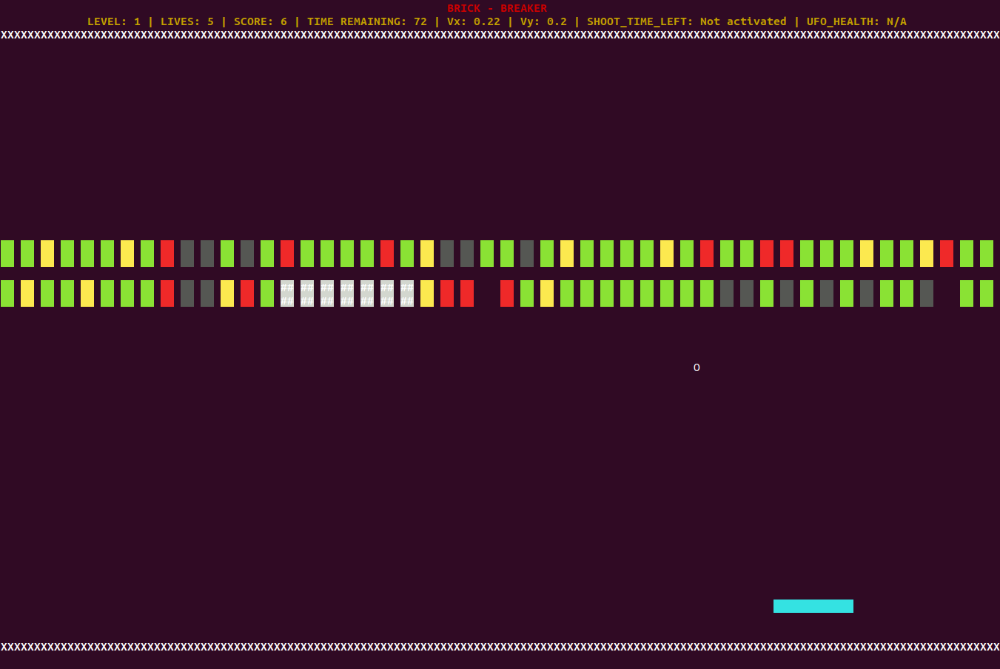

Brick-Breaker : Terminal-based Python Game  

Overview:  

Brick breaker is a classic arcade game, developed in Python3 (terminal-based). The player uses a paddle to bounce a ball and smash the wall of bricks. The aim is to small all bricks and get the highest score. A life is lost when the ball touches the ground below the paddle.  

Details of the Game:  

- You move the paddle left or right to direct the ball and prevent it from hitting ground below paddle.  

- Meanwhile, you also try to collect some power-ups which fall randomly when a brick is broken.  

- There are a total of 6 types of bricks:  
	1. Red Brick - This type of brick needs to be smashed 3 times before breaking. It rewards one point per smash.  
	2. Yellow Brick - This type of brick needs to be smashed 2 times before breaking. It rewards two points per smash.  
	3. Green Brick - This type of brick needs to be smashed only 1 time before breaking. It rewards three points per smash.  
	4. White Brick - This is a BONUS brick. It occurs in groups of not less than 6 and upon contact of any one brick of the group, all the bricks along with the adjacent ones are broken.  
	5. Black Brick - This is an UNBREAKABLE brick. This cannot be smashed by normal ball. You need to have the Through-Ball powerup activated or the brick should be adjacent to white bricks to be smashed.
	6. Rainbow Brick - This brick changes color and strength from among Red, Yellow or Green bricks. On contact with the ball, the color change stops and the brick attains the color present at the moment of contact with the ball.  

- A Red brick upon first contact with normal ball changes to Yellow one. Similarly, a Yellow brick upon first contact with normal ball changes to Green one.  

- After a certain time, the bricks start falling whenever the ball bounces off the paddle. Once the lowermost brick reaches the level of paddle, the game gets over.  

- There are 3 levels of the game, each with different layouts. The last level is the boss level where the boss enemy appears in the form of UFO. It tries to kill you with bombs and you have to evade them. (For testing purpose, key 'P' can be used to jump to next level .)  

- There are 6 types of powerups:
	1. Expand Paddle (>) - Increases the size of the paddle.
	2. Shrink Paddle (<) - Decreases the size of the paddle.
	3. Fast Ball (?) - Increases the speed of ball.
	4. Thru-Ball (@) - This enables the ball to destroy and go through any brick it touches, irrespective of the strength of the wall.
	5. Fire-Ball (G) - This acts similar to the exploding white bricks, except the same effect is caused by ball on hitting the bricks.  
	6. Shooting Paddle (|) - This enables the paddle to shoot bullets to break the brick. On breaking with the bullet, player gains 5 points.   

- The powerups initially attain the velocity of the ball and fall under the effect of gravity. You must catch the falling powerup through the paddle to activate it. Once caught, the power up stays activated for 20 seconds.  

- You get 5 lives for the game. If you are unable to catch the ball through the paddle, life decreases by one. When it reaches 0, the game ends.  

- The duration of the game is 100 seconds. After 100 seconds, the game ends.  

- Sound effects are added for better user experience.  

How to play:  

- Run the following code to start the game:  
	python3 main.py  
- Use ‘A’ to move the paddle towards the left.  
- Use ‘D’ to move the paddle towards the right.  
- Use ‘W’ to launch the ball.  
- Use ‘Q’ to quit the game anytime.  
- Use 'P' to jump to next level.  
- Use 'X' to shoot bullets.  

Requirements:  

Python 3  
Python libraries - colorama and numpy  

Concepts Implemented:  

- Inheritance - Inheritance allows a child class to inherit all the methods and properties from a parent class. A parent class Object is declared from which multiple elements are inherited.  
- Polymorphism - Polymorphism allows us to define methods in the child class with the same name as defined in their parent class.  
- Abstraction - Abstraction means hiding the complexity and only showing the essential features of the object.  
- Encapsulation - The idea of wrapping data and the methods that work together as a single entity. Prevents accidental modification of data. Encapsulation is the practical implementation of abstraction.  

